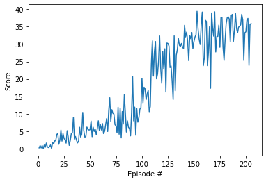

# Solving the reacher environment with Deep Deterministic Policy Gradient

## Overview

This report describes the implementation of a Deep Deterministic Policy Gradient (DDPG) algorithm. The implementation is done in Python using PyTorch.

## Learning algorithm

The learning algorithm can be divided into two separate parts: the DDPG itself ([model.py](model.py)) and the agent that uses it ([ddpg_agent.py](ddpg_agent.py)) along with the policy to update the network.

### DDPG architecture ([model.py](model.py))

DDPG is an algorithm based on the actor-critic ideas, and we can see it as a DQN implementation for continuous spaces. In an actor-critic method we usually have two separate networks:

* The actor, a policy-based network that learns the optimal policy; in this case, in a deterministic way.
* The critic, a value-based network that learns to evaluate the optimal value function using the best action learned from the actor.

In particular, DDPG uses these two networks, modified: for both the actor and the critic, it uses a DQN-style update. Thus, the architecture to solve the environment is the following:

* For the actor:
  * Input: 33 nodes (`state_size`).
  * Hidden layer 1: 256 nodes by default (`fc1_units`) with a ReLU activation and batch normalization.
  * Hidden layer 2: 256 nodes by default (`fc2_units`) with a ReLU activation and batch normalization.
  * Output layer: 4 nodes as for the number of possible actions (`action_size`) with tanh activation.
* For the critic:
  * Input: 33 nodes (`state_size`).
  * Hidden layer 1: 256 nodes by default (`fcs1_units`) with a ReLU activation and batch normalization.
  * Hidden layer 2: 256 nodes by default (`fc2_units`) with  a ReLU activation.
  * Hidden layer 3: 128 nodes by default (`fc3_units`) with a ReLU activation.
  * Output layer: 1 node for the Q-value output.

### Agent ([ddpg_agent.py](ddpg_agent.py))

Since the agent is following a DDPG architecture, it has an actor with two Q-Networks (`actor_local` and `actor_target`) and a critic with two Q-Networks (`critic_local` and `critic_target`). The selected optimizer is Adam.

DDPG trains a deterministic policy in an off-policy way. Because the policy is deterministic, if the agent were to explore on-policy, in the beginning it would probably not try a wide enough variety of actions to  find useful learning signals. To make DDPG policies explore better, an [Ornstein-Uhlenbeck noise](https://en.wikipedia.org/wiki/Ornstein%E2%80%93Uhlenbeck_process) is added to its actions at training time.

The agent has a replay buffer where it stores several experiences to learn from. When the replay buffer is big enough (>`BATCH_SIZE`), the agent performs the learning step, where it:

1. Gets the predicted next-state actions and Q-values from the target models for the critic
2. Computes critic Q targets for current states
4. Computes and minimizes the critic loss
4. Computes and minimizes the actor loss
5. Updates the target networks with a soft update

### Hyperparameters

| Hyperparameter       | Value   | Description                                                  |
| -------------------- | ------- | ------------------------------------------------------------ |
| `BUFFER_SIZE`        | 1000000 | Maximum size of the experience replay buffer                 |
| `BATCH_SIZE`         | 128     | Number of experiences sampled in one batch to learn from     |
| `GAMMA`              | 0.99    | Discount factor for future rewards                           |
| `TAU`                | 0.001   | Controls the update of the target Q-Network from the online Q-Network |
| `LR_ACTOR`           | 0.0001  | Learning rate for the actor                                  |
| `LR_CRITIC`          | 0.001   | Learning rate for the critic                                 |
| `WEIGHT_DECAY`       | 0.0     | L2 weight decay                                              |
| `fc1_units` (actor)  | 256     | Size of the first hidden layer for the actor                 |
| `fc2_units` (actor)  | 256     | Size of the second hidden layer for the actor                |
| `fcs1_units`(critic) | 256     | Size of the first hidden layer for the critic                |
| `fc2_units` (critic) | 256     | Size of the second hidden layer for the critic               |
| `fc3_units`(critic)  | 128     | Size of the third hidden layer for the critic                |
| `n_episodes`         | 2000    | Number of episodes                                           |
| `max_t`              | 1000    | Number of steps per episode                                  |

## Results

The agent was able to learn how to solve the environment. In particular, you can see in the following plot how it could achieve that:

The environment is solved when the agent is able to get an average score of +30 over 100 consecutive episodes. In this case, the agent solved the environment after 205 episodes.

## Future work

Since this is just the first version for solving the environment, several actions can be made to improve this project:

1. One of the ideas is to implement a prioritized experience replay (like [this one](https://github.com/Damcy/prioritized-experience-replay) or [this other one](https://github.com/rlcode/per)) in order to see if it speeds up learning. [Paper](https://cardwing.github.io/files/DDPG-SMC.pdf) about that.
2. The current implementation adds Ornstein-Uhlenbeck noise to the action space. However, it has been shown that adding noise to the parameters of the neural network policy can improve performance.
3. Turn off OU noise and use random noise just to see if it works as well.
4. Adding dropouts in critic network.
5. Implement other algorithms to solve the environment in order to see what is better suited for these kinds of tasks. For starters, I would implement:
   * [Trust Region Policy Optimization - TRPO](https://arxiv.org/abs/1502.05477).
   * [Proximal Policy Optimization - PPO](https://arxiv.org/abs/1707.06347).
   * [Asynchronous Advantage Actor-Critic - A3C](https://arxiv.org/abs/1602.01783).
   * [Distributed Distributional Deep Deterministic Policy Gradients - D4PG](https://arxiv.org/abs/1804.08617).
6. After comparing all the algorithms, I would try to solve the environment with 20 agents, making the necessary modifications to the algorithms to run in such an environment.
7. There exist another challenge: solving a different and more difficult environment called [Crawler](https://github.com/Unity-Technologies/ml-agents/blob/master/docs/Learning-Environment-Examples.md#crawler). I would adapt the algorithms for this environment and see how it works.